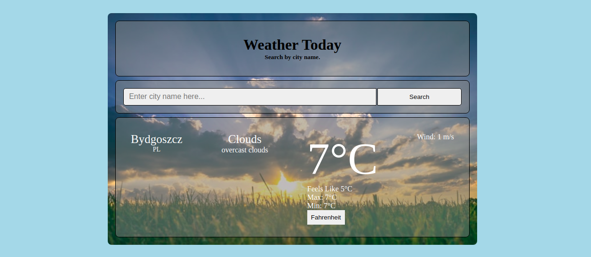

# Weather App
> This project is a simple web app that shows the weather report of a choosen city all over the world.  
> In this app, users can enter the name of a city and see the weather. Users can switch between metric units (celcius degree) and imperial units (fahrenheit degree) to see the results.  
> This project is created as an assignment from JavaScript module of Microverse main curriculum. The main purpose of this project is to practice JavaScript Async-Await functions and working with APIs.  
>The [OpenWeather](https://openweathermap.org/) API has been used to get the weather information.



## Built With
- JavaScript
- HTML 5 and CSS 3.

## Live Demo

[Live Demo Link](https://weather-app-praz.netlify.app/)

## Getting Started

Just fork or clone the project and you are good to go.

## Using

After forking or cloning the priject, navigate to the project directory and enter following commands in the terminal.

```npm install```  
```npm run build```

Now find the index.html page inside dist folder and open it in any web browser.

## Author

👤 **Prajwal Thapa**

- Github: [praz99](https://github.com/praz99)
- Twitter: [@thapa_praz](https://twitter.com/thapa_praz)
- LinkedIn: [prazwal-thapa](https://linkedin.com/in/prazwal-thapa)
- Email: t.prazwal@gmail.com

## 🤝 Contributing

Contributions, issues and feature requests are welcome!

Feel free to check the [issues page](issues/).

## Show your support

Give a ⭐️ if you like this project!

## Acknowledgments
- [OpenWeather](https://openweathermap.org/)
- [The Odin Project](https://www.theodinproject.com/courses/javascript/lessons/weather-app)
- [Webpack](https://webpack.js.org/)
- All images used are taken from [UnSplash](https://unsplash.com/)

## 📝 License

This project is [MIT](./LICENSE) licensed.